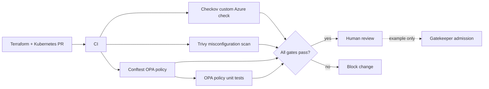

# Azure Policy DevSecOps Lab

An original, deployment-free policy-as-code lab showing layered IaC and Kubernetes gates with Checkov, Trivy, Conftest/OPA, and a Gatekeeper admission example. Paired compliant/noncompliant fixtures prove both allow and deny paths.



## Controls

- Checkov custom policy rejects Azure Storage accounts with public network access.
- Trivy scans Terraform and Kubernetes configuration for high/critical misconfigurations.
- Conftest policy rejects root/privileged containers, privilege escalation, missing CPU limits, and `latest` tags.
- OPA unit tests and deliberately unsafe fixtures ensure policies fail closed.
- Gatekeeper `ConstraintTemplate` and `Constraint` illustrate cluster admission integration.
- `THREAT-MODEL.md` documents boundaries, threats, mitigations, and residual risk.

## Local quickstart

Install Python 3.11+, Checkov, Trivy, and Conftest; then:

```bash
python -m pip install checkov==3.2.461
make test
```

Representative output:

```text
Passed checks: 1, Failed checks: 0
2 tests, 2 passed, 0 warnings, 0 failures
FAIL - fixtures/noncompliant/deployment.yaml - noncompliant-api: container "api" must not be privileged
```

The final failure is expected and inverted by `make negative`; `make test` exits zero only if compliant fixtures pass and unsafe fixtures are rejected.

Individual commands:

```bash
checkov -d fixtures/compliant --external-checks-dir checkov/custom --check CUSTOM_AZURE_001
trivy config --exit-code 1 --severity HIGH,CRITICAL fixtures/compliant
conftest verify --policy policy/kubernetes
conftest test fixtures/compliant/deployment.yaml --policy policy/kubernetes
```

## Status, limitations, and security

Portfolio lab only; it does **not** deploy resources, install Gatekeeper, connect to Azure, or claim compliance. Tool findings depend on versions and rule coverage. The Azure fixture uses illustrative names and may need additional properties before real planning. The admission example covers only Deployments and two controls. Production use should pin actions by commit SHA, verify downloaded checksums, protect policy changes, sign images, define exception expiry, scan secrets/dependencies, run Azure Policy and Defender, and monitor runtime drift. Never place credentials in fixture or report files.

## Author and license

Prashant Rajguru ([@prashantyr](https://github.com/prashantyr), rajguru.prashant@gmail.com). MIT licensed.
