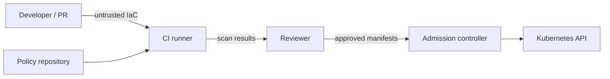

# Threat model

## Scope and assets

This lab protects infrastructure-as-code review and Kubernetes admission examples. Assets are pipeline integrity, policy source, build evidence, cloud configuration intent, and workload isolation. It does not deploy or operate infrastructure.

## Trust boundaries

## Key threats and mitigations

- **Malicious IaC or manifest:** Checkov, Trivy, and Conftest gates; least-privilege CI permissions; review required.
- **Policy bypass/change:** policy tests, fixture assertions, protected branches, CODEOWNERS and signed commits recommended.
- **Compromised actions/tools:** pin actions to immutable SHAs in production, verify binary checksums, use dependency review and isolated runners.
- **Overprivileged workload:** deny privileged/root execution and privilege escalation; require resource limits and immutable tags.
- **Public cloud exposure:** custom Checkov rule rejects public Azure Storage networking.
- **Secret leakage:** no credentials are required; `.env` and generated reports are ignored; secret scanning is recommended.
- **False assurance:** multiple scanners overlap but do not prove runtime safety or Azure Policy enforcement.

## Residual risks

Static analysis cannot observe runtime drift, image provenance, zero-day vulnerabilities, identity misuse, network paths, or post-admission mutation. Gatekeeper examples need separate installation and governance. Production controls should add Azure Policy/Defender, workload identity, signed images, SBOMs, runtime monitoring, drift detection, break-glass procedures, and scanner exception expiry.
